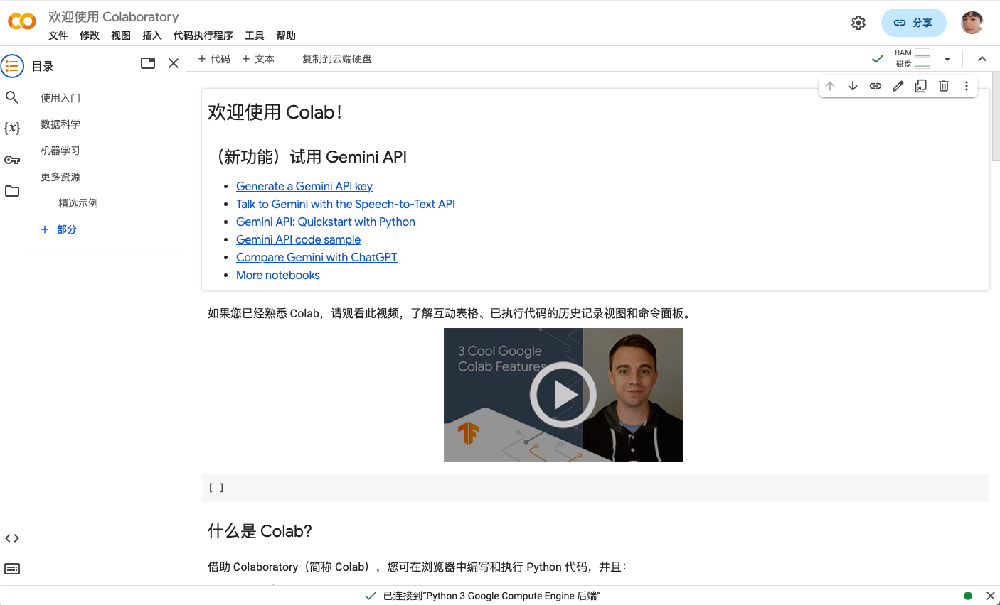
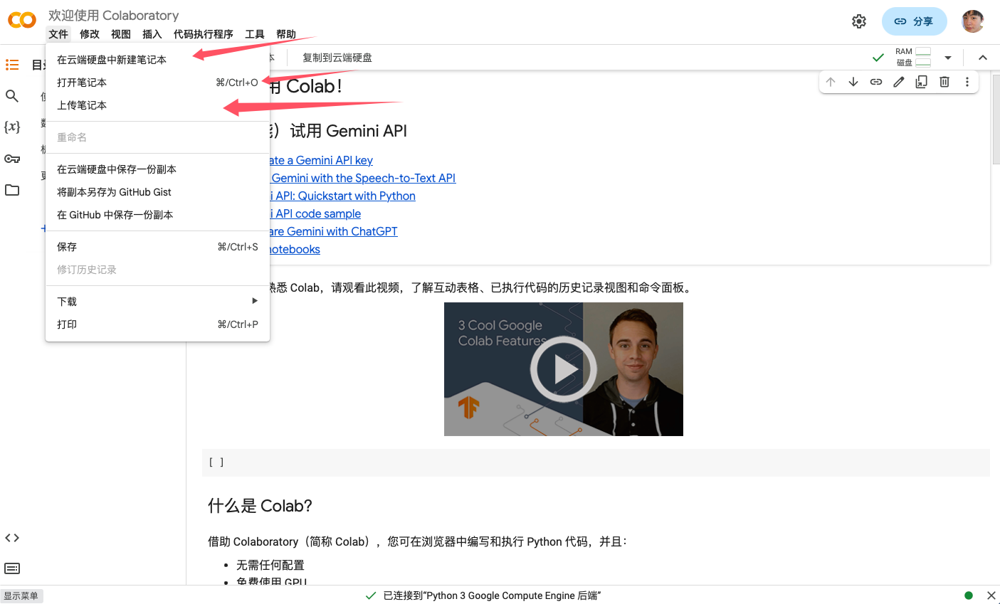
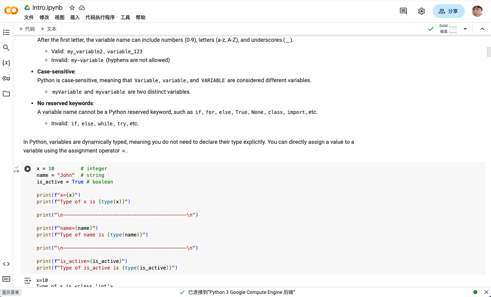

# **Google Colab 使用指南**

## **什么是Google Colab？**
- 一个免费的云端Jupyter笔记本平台，无需安装任何软件
- 支持Python代码运行、数据分析和机器学习
- 提供免费的GPU/TPU算力（需手动开启）
- 所有文件保存在Google云端硬盘中

---


## **快速步骤**

### **1. 访问Colab**
- 打开浏览器，访问 [https://colab.research.google.com](https://colab.research.google.com)
- 使用Google账号登录（没有账号需先注册）
- 

### **2. 创建新笔记本**
- 点击左上角"文件" → "新建笔记本"
- 或直接访问 [https://colab.new](https://colab.new)
- 

### **3. 界面初识**
- 代码单元：灰色背景区域，可输入Python代码
- 文本单元：双击文字区域可编辑说明文档（支持Markdown格式）
- 点击▶️运行当前单元格，按`Shift+Enter`运行并跳转到下一单元格
- 

### **4. 运行第一个程序**
```python
print("Hello Colab!")
# 点击左侧播放按钮或按Ctrl+Enter运行
```

---


## **核心功能操作**

### **1.上传本地文件**

1. 点击左侧文件夹图标打开文件管理器
2. 拖拽文件到文件区，或点击上传按钮
3. 在代码中使用路径访问：
```python
import pandas as pd
df = pd.read_csv("/content/上传的文件名.csv")
```


### **2.使用GPU加速**

1. 点击顶部菜单"运行时" → "更改运行时类型"
2. 在"硬件加速器"选择GPU/TPU
3. 验证是否生效：
```python
import tensorflow as tf
tf.test.gpu_device_name() # 显示GPU信息
```


### **3.安装第三方库**

在代码单元格中输入：
```python
!pip install 库名称  # 示例：!pip install numpy
```

---


## **重要提示**

- 每次最长连续运行时间：12小时（免费版）
- 闲置30分钟会自动断开
- 文件默认保存在临时空间，重要文件需手动保存到Google Drive：
```python
from google.colab import drive
drive.mount('/content/drive')  # 授权后可将文件保存到自己的云端硬盘
```

---


## **常见问题解决**

❓ 代码运行卡住 → 重启运行时（"运行时" → "重新启动运行时"）
❓ 找不到上传的文件 → 检查路径是否为`/content/文件名`
❓ GPU不可用 → 检查是否已选择GPU运行时类型
❓ 数据丢失 → 及时保存重要文件到Google Drive

---


## **导出为PDF**

1. 点击"文件" → "打印"
2. 目标打印机选择"另存为PDF"
3. 调整页面边距设置为"最小值"

